# Stouffville-By-laws-AI
AI-powered web application that makes Stouffville's municipal bylaws accessible and understandable to residents and municipal officers through natural conversation.

## Development Setup with Docker

This project uses Docker to create a consistent development environment. The setup includes a Python Flask backend that can be easily deployed and tested.

### Prerequisites

- [Docker](https://www.docker.com/get-started) installed on your machine
- [Docker Compose](https://docs.docker.com/compose/install/) (included with Docker Desktop on Windows/Mac)
- Git for version control
- Google Gemini API key (for AI capability)
- Voyage AI API key (for vector embeddings)

### Getting Started

1. Clone the repository:
   ```bash
   git clone https://github.com/Cadence-GitHub/Stouffville-By-laws-AI.git
   cd Stouffville-By-laws-AI
   ```

2. Set up environment variables:
   Create a `.env` file in the root directory with the following:
   ```
   GOOGLE_API_KEY=your_gemini_api_key_here
   VOYAGE_API_KEY=your_voyage_api_key_here
   ```

3. Build the backend Docker image:
   ```bash
   # Make the build script executable if needed
   chmod +x build-backend.sh
   
   # Build the backend image
   ./build-backend.sh
   ```

4. Start the backend service using Docker Compose:
   ```bash
   docker-compose up
   ```
   
   Or run it in detached mode:
   ```bash
   docker-compose up -d
   ```

5. Access the backend API:
   - The API will be available at http://localhost:5000
   - Test the API with: `curl http://localhost:5000/api/hello`
   - Access the demo web interface at http://localhost:5000/api/demo
   - View specific bylaws at http://localhost:5000/static/bylawViewer.html?bylaw=BYLAW-NUMBER

### Development Workflow

- **Backend Files**: The backend code is in the `backend/` directory
  - `app.py`: Main Flask application
  - `app/`: Application package containing templates, prompts, and ChromaDB integration
  - `requirements.txt`: Python dependencies
  - `Dockerfile`: Container configuration

- **Database Files**: The by-laws database is in the `database/` directory
  - `parking_related_by-laws.json`: Contains by-laws related to parking regulations
  - `search_bylaws.py`: Utility script for searching and extracting by-laws by keyword
  - `init_chroma.py`: Script to initialize ChromaDB with by-laws data
  - `chroma-data/`: Directory containing ChromaDB vector database files

- **Static Assets**: Frontend assets are in the `backend/app/static/` directory
  - `demo.css` and `demo.js`: Styling and functionality for the demo interface
  - `bylawViewer.html`, `bylawViewer.css`, and `bylawViewer.js`: Bylaw viewer interface

- **Live Code Changes**: 
  - The backend directory is mounted as a volume in the container
  - The database directory is mounted as a volume in the container
  - Changes to Python files will be reflected immediately when you refresh (Flask debug mode is enabled)

- **Managing Docker Containers**:
  - View running containers: `docker-compose ps`
  - View logs: `docker-compose logs -f`
  - Stop containers: `docker-compose down`

- **Rebuilding After Dependency Changes**:
  - If you modify `requirements.txt`, you'll need to rebuild the image:
    ```bash
    ./build-backend.sh
    docker-compose up -d
    ```

### API Endpoints

- `GET /api/hello`: Returns a greeting message in JSON format
- `POST /api/ask`: Processes AI queries about bylaws
  - Requires JSON with a 'query' field
  - Optionally accepts 'model' parameter to specify which Gemini model to use
- `GET /api/bylaw/<bylaw_number>`: Retrieves full data for a specific bylaw
  - Intelligently handles different format variations of bylaw numbers
  - Returns complete metadata and content for the requested bylaw
- `GET /api/demo`: Returns a simple web interface for testing the AI functionality
- `POST /api/demo`: Processes form submissions from the demo interface

### AI Integration

This project uses Google's Gemini AI models through the LangChain framework. Make sure your `.env` file contains a valid Google API key to enable AI functionality.

The application leverages ChromaDB (version 0.6.3) for vector search with Voyage AI embeddings to efficiently retrieve relevant by-laws based on semantic similarity.

Available Gemini models:
- gemini-mixed (uses best model for each query stage)
- gemini-2.0-flash-lite (fastest, lowest cost)
- gemini-2.0-flash (balanced speed/quality)
- gemini-2.5-flash-preview-04-17 (fast, high quality)
- gemini-2.5-pro-exp-03-25 (highest quality, most expensive)

When using the gemini-mixed option:
- Query transformation uses gemini-2.0-flash
- First query (bylaws) uses gemini-2.5-flash-preview-04-17
- Second query (filtered) uses gemini-2.0-flash
- Third query (layman's terms) uses gemini-2.0-flash

Each prompt type uses a specific temperature setting for optimal results:
- Bylaws prompt: 0.0 (consistent, deterministic outputs)
- Filtered prompt: 0.0 (consistent, deterministic outputs)
- Layman's terms prompt: 0.7 (more creative, natural language)
- Enhanced search prompt: 0.2 (slightly varied outputs while maintaining accuracy)

Dependencies for AI integration:
- langchain
- langchain-google-genai
- google-generativeai
- python-dotenv
- chromadb
- langchain-chroma
- langchain-voyageai
- tiktoken

### Key Features

- **Enhanced Search**: Transforms user queries into formal, bylaw-oriented language to improve semantic search results, combining both original and transformed search results to maximize retrieval relevance.
- **Token Counting and Cost Calculation**: Tracks token usage for both input and output, calculating costs based on model-specific pricing to provide transparency about API usage.
- **Expired By-laws Filtering**: The system generates a complete response with all by-laws, then uses this response to create a filtered version showing only active by-laws. This two-step approach optimizes costs and speed by reducing the context size for the second prompt.
- **Layman's Terms Conversion**: After filtering active by-laws, a third prompt transforms the technical legal language into plain, everyday language without bylaw references, making information more accessible to residents.
- **Comparison Mode**: Option to display all three versions of the answer (complete, filtered active only, and layman's terms) for comparison.
- **Model Selection**: Users can select which Gemini model to use based on their requirements for speed, cost, and quality.
- **Performance Metrics**: The demo interface displays detailed timing information showing how long each step takes (by-law retrieval, first prompt execution, second prompt execution, and third prompt execution).
- **Bylaw Limit Selection**: In the demo interface, users can choose how many relevant bylaws to retrieve (5, 10, 15, or 20) for their queries.
- **Interactive Bylaw Viewer**: A dedicated interface to view complete bylaw information with rich formatting, dark mode support, and detailed metadata display.
- **Direct Bylaw Linking**: AI responses include hyperlinks to specific bylaws that open in the bylaw viewer (either in a new tab or sidebar).
- **Intelligent Bylaw Number Matching**: The system can match bylaw numbers even with different formatting variations (spacing, dashes, etc.).
- **Visual UI Improvements**: Enhanced demo interface with better layout and formatting options.
- **Bug Reporting System**: Each answer type includes a "Problem? Log a bug!" button that automatically captures query details, model information, retrieved bylaws, timing data, and the response content, formatting it as Markdown for clear reporting in GitHub Issues.

### Bylaw Viewer Feature

The application includes an interactive bylaw viewer that:

1. Displays detailed information about specific bylaws in a user-friendly format
2. Supports direct linking to bylaws from AI responses using hyperlinks
3. Can open bylaws in a sidebar without leaving the main interface
4. Features a dark mode toggle for better readability
5. Intelligently formats:
   - Tables and lists from bylaw content
   - Location addresses with Google Maps links
   - Links to original PDF documents
   - Formatted text with proper spacing and line breaks
6. Shows comprehensive metadata including:
   - Bylaw number, type, and year
   - Layman's explanation in simple terms
   - Key dates and information
   - Conditions and clauses
   - Legal topics and related legislation
   - Entity and designation information
   - And many more fields when available

### Vector Database Setup

To initialize the ChromaDB vector database with by-laws data:

1. Make sure the ChromaDB container is running (`docker-compose up -d`)
2. Run the initialization script:
   ```bash
   cd database
   python init_chroma.py
   ```

## Contributing

1. Create a feature branch from main
2. Make your changes
3. Submit a pull request

## Next Steps

- Frontend development (React application)
- Expanded AI training on Stouffville bylaws
- Advanced query processing

## System Architecture

The Stouffville By-laws AI application follows a modular architecture designed for scalability and maintainability. Below is a diagram illustrating the system components and their interactions:

```mermaid
graph TB
    %% External services
    GoogleAPI["Google Generative AI API"]
    VoyageAPI["Voyage AI API"]

    %% Docker containers
    subgraph Docker["Docker Environment"]
        Backend["Backend Container"]
        ChromaDB["ChromaDB Container"]
    end

    %% Components in Backend
    subgraph BackendComponents["Backend"]
        FlaskApp["Backend App (app.py)"]
        ChromaRetriever["ChromaDB Retriever (chroma_retriever.py)"]
        GeminiHandler["Gemini Handler (gemini_handler.py)"]
        PromptsModule["Prompts Module (prompts.py)"]
        TokenCounter["Token Counter (token_counter.py)"]
        Demo["Web Demo (templates/demo.html)"]
        BylawViewer["Bylaw Viewer (static/bylawViewer.html)"]

        %% Subgraph for API Calls
        subgraph APICalls["API Endpoints"]
            API1["/api/ask (POST)"]
            API2["/api/demo (GET/POST)"]
            API3["/api/hello (GET)"]
            API4["/api/bylaw/ (GET)"]
        end
    end

    %% Data Processing Components
    subgraph DataProcessing["Data Processing"]
        PrepareByLaws["Prepare JSON Bylaws (prepare_json_bylaws_for_db.py)"]
        SearchBylaws["Search Bylaws (search_bylaws.py)"]
        InitChroma["Initialize ChromaDB (init_chroma.py)"]
        BylawExpiryAnalyzer["Bylaw Expiry Analyzer (bylaw_expiry_analyzer.py)"]
        BylawRevocationAnalysis["Bylaw Revocation Analysis (bylaw_revocation_analysis.py)"]
    end

    %% Data Storage
    ByLawsData[("By-laws JSON Data")]
    ChromaDBData[("ChromaDB Vector Store")]


    %% Connections between components
    PrepareByLaws --> ByLawsData
    SearchBylaws --> ChromaDB
    FlaskApp --> GeminiHandler
    FlaskApp --> ChromaRetriever
    FlaskApp --> Demo
    FlaskApp --> TokenCounter
    ChromaRetriever --> ChromaDB
    ChromaRetriever <--> BylawViewer
    GeminiHandler --> PromptsModule
    GeminiHandler --> GoogleAPI
    TokenCounter --> GeminiHandler
    InitChroma <--> VoyageAPI
    InitChroma --> ByLawsData
    InitChroma --> ChromaDB
    API1 --> FlaskApp
    API2 --> FlaskApp
    API3 --> FlaskApp
    API4 --> ChromaRetriever
    API4 --> BylawViewer
    Demo --> BylawViewer
    
    
    %% Container connections
    Backend --> ChromaDB
    Backend -.-> BackendComponents
    ChromaDB -.-> ChromaDBData

    %% Data flow for initialization
    ByLawsData --> InitChroma
    
    %% User interactions
    User(("User")) --> API1
    User --> API2
    User --> API3
    User --> API4
    User --> Demo
    User --> BylawViewer
    style GoogleAPI fill:#0CC0DF
    style VoyageAPI fill:#0CC0DF
```



### Architecture Overview

The system implements a Retrieval-Augmented Generation (RAG) architecture with these key components:

1. **Data Flow Pipeline**:
   - Raw by-law documents are processed and stored as JSON
   - `prepare_json_bylaws_for_db.py` creates subsets of bylaws by keyword for further processing
   - `bylaw_expiry_analyzer.py` identifies expired bylaws based on their content
   - `bylaw_revocation_analysis.py` identifies bylaws that revoke other bylaws
   - Voyage AI generates embeddings for these documents using the `voyage-3-large` model
   - ChromaDB indexes embeddings for efficient semantic retrieval using HNSW algorithm
   - When a query is received, relevant by-laws are retrieved and passed to Gemini AI
   - If enhanced search is enabled, the system transforms the query into legal language and performs two searches
   - Gemini generates three different responses:
     - Complete response with all retrieved by-laws
     - Filtered response with only active by-laws
     - Layman's terms response with simplified language and no bylaw references

2. **Backend Core**:
   - Flask application handles HTTP routing and request processing
   - ChromaDB Retriever manages vector database interactions
   - Gemini Handler orchestrates AI model interactions with multiple model options
   - Prompts Module contains templates that structure AI responses
   - Token Counter calculates token usage and associated costs
   - Bylaw Viewer provides an interactive interface to explore complete bylaw information

3. **Database Tools**:
   - `init_chroma.py` converts JSON bylaws into vector embeddings stored in ChromaDB
   - `search_bylaws.py` allows semantic search, keyword search, or combinations of both
   - Vector search is optimized with configurable HNSW parameters (M, construction_ef, search_ef)
   - Bylaw retrieval by number supports multiple format variations for flexible matching

4. **External Services Integration**:
   - Google Generative AI provides LLM capabilities via multiple Gemini models (2.0-flash-lite, 2.0-flash, etc.)
   - Voyage AI supplies high-quality text embeddings for semantic search

5. **User Interface Options**:
   - Web demo interface with model selection and bylaw limit options
   - Enhanced search option for improved semantic retrieval
   - Token usage and cost information
   - Performance metrics showing timing information for each processing step
   - Option to compare all three versions of the answer (complete, filtered active only, and layman's terms)
   - Interactive bylaw viewer for exploring specific bylaws in detail
   - Sidebar integration that allows viewing bylaws without leaving the main interface
   - One-click bug reporting that generates formatted GitHub issues with complete context information

This architecture ensures that the system can accurately respond to user queries about Stouffville by-laws by finding the most semantically relevant information and presenting it in a natural, conversational format.
