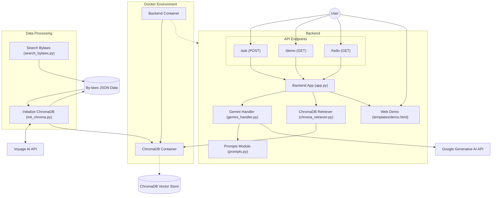

# Stouffville-By-laws-AI
AI-powered web application that makes Stouffville's municipal bylaws accessible and understandable to residents and municipal officers through natural conversation.

## Development Setup with Docker

This project uses Docker to create a consistent development environment. The setup includes a Python Flask backend that can be easily deployed and tested.

### Prerequisites

- [Docker](https://www.docker.com/get-started) installed on your machine
- [Docker Compose](https://docs.docker.com/compose/install/) (included with Docker Desktop on Windows/Mac)
- Git for version control
- Google Gemini API key (for AI capability)
- Voyage AI API key (for vector embeddings)

### Getting Started

1. Clone the repository:
   ```bash
   git clone https://github.com/Cadence-GitHub/Stouffville-By-laws-AI.git
   cd Stouffville-By-laws-AI
   ```

2. Set up environment variables:
   Create a `.env` file in the root directory with the following:
   ```
   GOOGLE_API_KEY=your_gemini_api_key_here
   VOYAGE_API_KEY=your_voyage_api_key_here
   ```

3. Build the backend Docker image:
   ```bash
   # Make the build script executable if needed
   chmod +x build-backend.sh
   
   # Build the backend image
   ./build-backend.sh
   ```

4. Start the backend service using Docker Compose:
   ```bash
   docker-compose up
   ```
   
   Or run it in detached mode:
   ```bash
   docker-compose up -d
   ```

5. Access the backend API:
   - The API will be available at http://localhost:5000
   - Test the API with: `curl http://localhost:5000/api/hello`
   - Access the demo web interface at http://localhost:5000/api/demo

### Development Workflow

- **Backend Files**: The backend code is in the `backend/` directory
  - `app.py`: Main Flask application
  - `app/`: Application package containing templates, prompts, and ChromaDB integration
  - `requirements.txt`: Python dependencies
  - `Dockerfile`: Container configuration

- **Database Files**: The by-laws database is in the `database/` directory
  - `parking_related_by-laws.json`: Contains by-laws related to parking regulations
  - `search_bylaws.py`: Utility script for searching and extracting by-laws by keyword
  - `init_chroma.py`: Script to initialize ChromaDB with by-laws data
  - `chroma-data/`: Directory containing ChromaDB vector database files

- **Live Code Changes**: 
  - The backend directory is mounted as a volume in the container
  - The database directory is mounted as a volume in the container
  - Changes to Python files will be reflected immediately when you refresh (Flask debug mode is enabled)

- **Managing Docker Containers**:
  - View running containers: `docker-compose ps`
  - View logs: `docker-compose logs -f`
  - Stop containers: `docker-compose down`

- **Rebuilding After Dependency Changes**:
  - If you modify `requirements.txt`, you'll need to rebuild the image:
    ```bash
    ./build-backend.sh
    docker-compose up -d
    ```

### API Endpoints

- `GET /api/hello`: Returns a greeting message in JSON format
- `POST /api/ask`: Processes AI queries about bylaws
  - Requires JSON with a 'query' field
  - Optionally accepts 'model' parameter to specify which Gemini model to use
- `GET /api/demo`: Returns a simple web interface for testing the AI functionality
- `POST /api/demo`: Processes form submissions from the demo interface

### AI Integration

This project uses Google's Gemini AI models through the LangChain framework. Make sure your `.env` file contains a valid Google API key to enable AI functionality.

The application leverages ChromaDB (version 0.6.3) for vector search with Voyage AI embeddings to efficiently retrieve relevant by-laws based on semantic similarity.

Available Gemini models:
- gemini-2.0-flash-lite (fastest, lowest cost)
- gemini-2.0-flash (balanced speed/quality, default)
- gemini-2.0-flash-thinking-exp-01-21 (better reasoning)
- gemini-2.5-pro-exp-03-25 (highest quality, most expensive)

Dependencies for AI integration:
- langchain
- langchain-google-genai
- google-generativeai
- python-dotenv
- chromadb
- langchain-chroma
- langchain-voyageai

### Key Features

- **Expired By-laws Filtering**: The system generates a complete response with all by-laws, then uses this response to create a filtered version showing only active by-laws. This two-step approach optimizes costs and speed by reducing the context size for the second prompt.
- **Comparison Mode**: Option to display both filtered (active only) and complete (including expired) answers side-by-side for comparison.
- **Model Selection**: Users can select which Gemini model to use based on their requirements for speed, cost, and quality.
- **Performance Metrics**: The demo interface displays detailed timing information showing how long each step takes (by-law retrieval, first prompt execution, and second prompt execution).
- **Bylaw Limit Selection**: In the demo interface, users can choose how many relevant bylaws to retrieve (5, 10, 15, or 20) for their queries.
- **Visual UI Improvements**: Enhanced demo interface with better layout and formatting options.

### Vector Database Setup

To initialize the ChromaDB vector database with by-laws data:

1. Make sure the ChromaDB container is running (`docker-compose up -d`)
2. Run the initialization script:
   ```bash
   cd database
   python init_chroma.py
   ```

## Contributing

1. Create a feature branch from main
2. Make your changes
3. Submit a pull request

## Next Steps

- Frontend development (React application)
- Expanded AI training on Stouffville bylaws
- Advanced query processing

## System Architecture

The Stouffville By-laws AI application follows a modular architecture designed for scalability and maintainability. Below is a diagram illustrating the system components and their interactions:



### Architecture Overview

The system implements a Retrieval-Augmented Generation (RAG) architecture with these key components:

1. **Data Flow Pipeline**:
   - Raw by-law documents are processed and stored as JSON
   - Voyage AI generates embeddings for these documents
   - ChromaDB indexes embeddings for efficient semantic retrieval
   - When a query is received, relevant by-laws are retrieved and passed to Gemini AI
   - Gemini generates natural language responses based on retrieved context

2. **Backend Core**:
   - Flask application handles HTTP routing and request processing
   - ChromaDB Retriever manages vector database interactions
   - Gemini Handler orchestrates AI model interactions
   - Prompts Module contains templates that structure AI responses

3. **External Services Integration**:
   - Google Generative AI provides LLM capabilities via Gemini models
   - Voyage AI supplies high-quality text embeddings for semantic search

This architecture ensures that the system can accurately respond to user queries about Stouffville by-laws by finding the most semantically relevant information and presenting it in a natural, conversational format.
