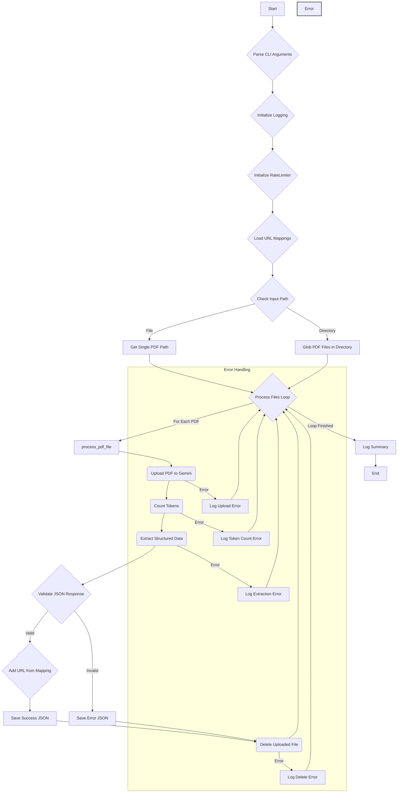

# PDF Data Extraction with Gemini API - Documentation

## Table of Contents

1.  [Overview](#overview)
2.  [Features](#features)
3.  [Prerequisites](#prerequisites)
4.  [Installation](#installation)
5.  [Configuration](#configuration)
6.  [Usage](#usage)
    *   [Command-Line Arguments](#command-line-arguments)
    *   [Examples](#examples)
7.  [Workflow Diagram](#workflow-diagram)
8.  [Core Components](#core-components)
    *   [Logging (`setup_logging`)](#logging-setup_logging)
    *   [URL Mappings (`load_url_mappings`)](#url-mappings-load_url_mappings)
    *   [Rate Limiter (`RateLimiter` Class)](#rate-limiter-ratelimiter-class)
    *   [File Upload (`upload_file`)](#file-upload-upload_file)
    *   [File Deletion (`delete_file`)](#file-deletion-delete_file)
    *   [Token Counting (`count_tokens`)](#token-counting-count_tokens)
    *   [Data Extraction (`extract_structured_data`)](#data-extraction-extract_structured_data)
    *   [JSON Validation (`validate_json_schema`)](#json-validation-validate_json_schema)
    *   [File Processing (`process_pdf_file`)](#file-processing-process_pdf_file)
    *   [Main Execution (`main`)](#main-execution-main)
9.  [Output](#output)
    *   [Success Output](#success-output)
    *   [Error Output](#error-output)
    *   [JSON Schema](#json-schema)
10. [Error Handling and Retries](#error-handling-and-retries)
11. [Rate Limiting Details](#rate-limiting-details)
12. [Customization](#customization)
13. [Troubleshooting](#troubleshooting)

---

## 1. Overview

This Python script automates the process of extracting structured data from PDF files using the Google Gemini API. It handles the uploading of PDF files, manages API rate limits, sends requests to the Gemini model with a specific prompt and schema for data extraction, and saves the results as JSON files. The script is designed to process either a single PDF file or all PDF files within a specified directory.

The primary use case is extracting specific information (like bylaw details, legal topics, entities, locations, etc.) from legal documents (PDFs) according to a predefined JSON schema.

---

## 2. Features

*   **PDF Processing:** Accepts a single PDF file or a directory of PDF files as input.
*   **Gemini API Integration:** Leverages the Gemini API for advanced data extraction capabilities.
*   **File Upload:** Uses the Gemini API's resumable upload feature for potentially large PDF files.
*   **URL Mapping:** Supports linking PDF files to source URLs via a CSV mapping file, which are included in the output JSON.
*   **Structured Data Extraction:** Employs a specific prompt and a predefined JSON schema to guide the Gemini model in extracting relevant information.
*   **Rate Limiting:** Implements a robust `RateLimiter` class to manage and respect Google's API limits (Requests Per Minute, Tokens Per Minute, Requests Per Day). Automatically waits when limits are approached or reached.
*   **Token Counting:** Estimates the token count for each PDF before the main extraction call.
*   **Retry Mechanism:** Includes exponential backoff retries for API requests (upload, delete, count tokens, extract data) to handle transient network issues or temporary API unavailability.
*   **Output Management:** Saves the extracted structured data as JSON files. Saves potential error responses with a distinct filename.
*   **File Cleanup:** Deletes the uploaded files from the Gemini API storage after successful processing to manage resources.
*   **Logging:** Provides comprehensive logging to both the console and a log file for monitoring and debugging.
*   **Command-Line Interface:** Easy-to-use interface with configurable options for API key, input/output paths, model selection, and rate limits.

---

## 3. Prerequisites

*   **Python:** Version 3.7 or higher.
*   **Google Gemini API Key:** You need an API key from Google Cloud Platform with the Gemini API enabled. See [Google AI documentation](https://ai.google.dev/) for instructions on obtaining a key.
*   **Python Libraries:**
    *   `requests`: For making HTTP requests to the Gemini API.
    *   `csv`: Standard library module for handling CSV files (included in Python).

---

## 4. Installation

1.  **Clone or Download:** Obtain the script file (`.py`).
2.  **Install Dependencies:** Open your terminal or command prompt and install the required `requests` library using pip:
    ```bash
    pip install requests
    ```

---

## 5. Configuration

*   **API Key:** The Gemini API key is the most critical configuration element. It must be provided via the `--api-key` or `-k` command-line argument every time the script is run. **Treat your API key securely and avoid hardcoding it directly into the script, especially if sharing or committing to version control.** Consider using environment variables or secure secret management solutions for production environments.
*   **URL Mappings (Optional):** Prepare a CSV file with mappings between PDF filenames and their source URLs. The CSV should have columns for filename and URL (with or without a header row).

---

## 6. Usage

Run the script from your terminal.

```bash
python your_script_name.py --api-key YOUR_API_KEY --input /path/to/input --output /path/to/output [OPTIONS]
```

### Command-Line Arguments

| Argument         | Short | Required | Default              | Description                                                              |
| :--------------- | :---- | :------- | :------------------- | :----------------------------------------------------------------------- |
| `--api-key`      | `-k`  | Yes      |                      | Your Google Gemini API key.                                              |
| `--input`        | `-i`  | Yes      |                      | Path to the input PDF file or a directory containing PDF files.          |
| `--output`       | `-o`  | Yes      |                      | Path to the directory where output JSON files will be saved.             |
| `--model`        | `-m`  | No       | `gemini-2.0-flash`   | The Gemini model ID to use for extraction (e.g., `gemini-1.5-pro-latest`). |
| `--rpm`          |       | No       | `15`                 | Rate limit: Maximum Requests Per Minute allowed.                         |
| `--tpm`          |       | No       | `1000000`            | Rate limit: Maximum Tokens Per Minute allowed (sum of tokens in requests). |
| `--rpd`          |       | No       | `1500`               | Rate limit: Maximum Requests Per Day allowed.                            |
| `--log-file`     | `-l`  | No       | `pdf_extraction.log` | Path to the file where logs will be written.                             |
| `--csv-file`     | `-c`  | No       |                      | Path to CSV file with filename-URL mappings.                             |

### Examples

1.  **Process a single PDF file:**
    ```bash
    python pdf_extractor.py \
        --api-key "YOUR_SECRET_API_KEY" \
        --input "/data/pdfs/bylaw_123.pdf" \
        --output "/data/output/json"
    ```

2.  **Process all PDF files in a directory using a specific model and custom rate limits:**
    ```bash
    python pdf_extractor.py \
        -k "YOUR_SECRET_API_KEY" \
        -i "/home/user/bylaw_documents/" \
        -o "/home/user/extracted_data/" \
        -m "gemini-1.5-flash-latest" \
        --rpm 10 \
        --tpm 800000 \
        --rpd 1000 \
        -l "/var/log/pdf_extractor.log"
    ```

3.  **Process PDF files with URL mappings:**
    ```bash
    python pdf_extractor.py \
        -k "YOUR_SECRET_API_KEY" \
        -i "/home/user/bylaw_documents/" \
        -o "/home/user/extracted_data/" \
        -c "/home/user/pdf_url_mapping.csv"
    ```

---

## 7. Workflow Diagram

This diagram illustrates the overall process flow of the script:



---

## 8. Core Components

### Logging (`setup_logging`)

*   **Purpose:** Configures the Python `logging` module.
*   **Functionality:**
    *   Creates a logger instance.
    *   Sets the logging level to `INFO`.
    *   Creates two handlers: one for writing logs to a file (specified by `--log-file`) and one for printing logs to the console.
    *   Defines a consistent timestamped format for log messages.
    *   Adds both handlers to the logger.
*   **Usage:** Called once at the beginning of the `main` function to establish logging for the entire script execution.

### URL Mappings (`load_url_mappings`)

*   **Purpose:** Loads mappings between PDF filenames and their source URLs from a CSV file.
*   **Functionality:**
    *   Takes a CSV file path as input.
    *   Reads the CSV file, handling both header and no-header formats.
    *   Creates a dictionary mapping PDF filenames to their respective URLs.
    *   Includes error handling for missing files or invalid CSV content.
    *   Logs the process and number of URLs loaded.
*   **Returns:** A dictionary where keys are PDF filenames and values are their corresponding URLs.
*   **Usage:** Called in the `main` function if the `--csv-file` argument is provided.

### Rate Limiter (`RateLimiter` Class)

*   **Purpose:** Enforces API rate limits provided by Google (RPM, TPM, RPD).
*   **Attributes:**
    *   `rpm_limit`, `tpm_limit`, `rpd_limit`: Stores the configured limits.
    *   `request_timestamps_minute`, `request_timestamps_day`: `deque` objects storing `datetime` timestamps of recent requests within the last minute and day, respectively.
    *   `token_usage_minute`: `deque` storing tuples of (`datetime`, `token_count`) for requests within the last minute.
    *   `day_start`: Records the timestamp when the current day's counting started, used for RPD logic reset.
*   **Methods:**
    *   `_clean_old_entries()`: Removes timestamps and token usage records older than their respective tracking windows (1 minute, 1 day). Also handles resetting the daily count if the date changes.
    *   `check_limits()`: Calculates current RPM, RPD, and TPM based on stored timestamps/token counts and compares them against the limits. Returns `True` if allowed, `False` otherwise, along with detailed limit status.
    *   `wait_if_needed()`: Checks limits using `check_limits()`. If any limit is exceeded, it calculates the necessary wait time (based on the oldest entry in the relevant deque or until midnight for RPD) and pauses execution using `time.sleep()`. Logs warnings about which limit was hit.
    *   `record_request(token_count=0)`: Appends the current timestamp to the minute and day deques. If `token_count` is provided, appends the timestamp and count to the token usage deque.

### File Upload (`upload_file`)

*   **Purpose:** Uploads a local PDF file to the Gemini API's temporary storage.
*   **Functionality:**
    *   Uses Google's **resumable upload protocol**.
    *   **Step 1 (Start):** Sends an initial POST request with `X-Goog-Upload-Protocol: resumable` and `X-Goog-Upload-Command: start` headers, along with file metadata (display name, size, MIME type). This request establishes the upload session and returns a unique `X-Goog-Upload-URL`.
    *   **Step 2 (Upload & Finalize):** Sends the actual file content (binary data) in a POST request to the `X-Goog-Upload-URL` obtained in Step 1, using `X-Goog-Upload-Command: upload, finalize`.
    *   Includes rate limiting checks (`rate_limiter.wait_if_needed()`) before each API call.
    *   Records the request (`rate_limiter.record_request()`) after each successful API call.
    *   Implements a retry mechanism with exponential backoff for both steps in case of transient errors.
*   **Returns:** The unique `file_uri` (e.g., `files/generated-file-id`) of the uploaded file on the Gemini platform.

### File Deletion (`delete_file`)

*   **Purpose:** Deletes a file from the Gemini API storage using its `file_uri`.
*   **Functionality:**
    *   Extracts the `file_name` (ID) from the provided `file_uri`.
    *   Sends an HTTP DELETE request to the appropriate Gemini API endpoint (`/v1beta/files/{file_name}`).
    *   Includes rate limiting checks and request recording.
    *   Implements a retry mechanism with exponential backoff.
*   **Returns:** `True` if deletion was successful (HTTP 2xx status), `False` otherwise.

### Token Counting (`count_tokens`)

*   **Purpose:** Estimates the number of tokens a given uploaded PDF file will consume when processed by the specified Gemini model.
*   **Functionality:**
    *   Sends a POST request to the model's `:countTokens` endpoint.
    *   The request body includes a simple prompt and the `file_data` reference (MIME type and `file_uri`).
    *   Includes rate limiting checks and request recording.
    *   Implements a retry mechanism with exponential backoff.
*   **Returns:** The estimated `totalTokens` as an integer.

### Data Extraction (`extract_structured_data`)

*   **Purpose:** The core function that sends the PDF and instructions to the Gemini model to extract data according to a specific schema.
*   **Functionality:**
    *   Sends a POST request to the model's `:generateContent` endpoint.
    *   **Request Body:**
        *   `contents`: Contains the prompt and the reference to the uploaded PDF (`file_data` with `mime_type` and `file_uri`).
        *   `generationConfig`:
            *   `temperature`: Controls randomness (set to 0.3 for more consistent outputs).
            *   `responseSchema`: Defines the **required JSON structure** for the output (see [JSON Schema](#json-schema) section). This instructs the model to format its response accordingly.
            *   `responseMimeType`: Explicitly set to `application/json` to enforce JSON output.
    *   **Prompt:** A detailed set of instructions telling the model how to act (parser of legal documents), what information to extract for each field in the schema, and specific formatting requirements. The prompt uses a clearer, more structured format with field names followed by descriptions.
    *   Includes rate limiting checks.
    *   Records the request *along with the previously estimated `token_count`* (`rate_limiter.record_request(token_count)`). This is crucial for TPM tracking.
    *   Implements a retry mechanism with exponential backoff.
    *   Parses the response: It expects the model to return the structured data within the `candidates[0].content.parts[0].text` field as a JSON string, which is then parsed into a Python dictionary using `json.loads()`. It handles potential variations in where the JSON might appear in the response text.
    *   Logs usage metadata (token counts) if returned by the API.
*   **Returns:** A Python dictionary containing the structured data extracted by the model, or the raw response dictionary if parsing fails or the structure is unexpected.

### JSON Validation (`validate_json_schema`)

*   **Purpose:** Performs a *basic heuristic check* to determine if the response from `extract_structured_data` likely contains the expected structured data or if it's an error/malformed response from the API.
*   **Functionality:**
    *   Checks if the top-level key `candidates` exists. Its presence often indicates an API error response rather than the desired structured JSON.
    *   Checks if a minimum percentage (70%) of key fields defined in the `expected_fields` list are present in the top level of the response dictionary. This helps distinguish between a valid (though potentially incomplete) extraction and a completely different response structure.
    *   The `expected_fields` list now includes the new field `bylawHeader` in addition to the other fields.
*   **Returns:** `True` if the response structure seems plausible, `False` otherwise.
*   **Note:** This is **not** a rigorous validation against the full JSON schema definition but a quick check to catch common API error formats.

### File Processing (`process_pdf_file`)

*   **Purpose:** Orchestrates the entire sequence of operations for a single PDF file.
*   **Functionality:**
    *   Takes API key, PDF path, output directory, model, rate limiter, and URL mapping as input.
    *   Determines the output JSON filename based on the input PDF filename.
    *   Calls `upload_file` to upload the PDF.
    *   Calls `count_tokens` to estimate token usage.
    *   Calls `extract_structured_data` to get the structured data.
    *   Calls `validate_json_schema` to perform the heuristic check on the response.
    *   If valid and URL mapping is available, adds the URL to the JSON response.
    *   If validation fails, adjusts the output filename to include `-error` and logs a warning.
    *   Saves the resulting Python dictionary (either the extracted data or the error response) to the determined output JSON file, ensuring the output directory exists.
    *   Calls `delete_file` to remove the uploaded file from Gemini storage.
    *   Wraps the entire process in a `try...except` block to catch and log any errors during the processing of this specific file.
*   **Returns:** `True` if the process completed without raising an exception, `False` otherwise.

### Main Execution (`main`)

*   **Purpose:** Entry point of the script; handles command-line arguments and manages the overall execution flow.
*   **Functionality:**
    *   Uses `argparse` to define and parse command-line arguments, including the new `--csv-file` argument.
    *   Calls `setup_logging` to initialize the logger.
    *   Creates an instance of the `RateLimiter` class using the limits provided via arguments.
    *   If a CSV file path is provided with `--csv-file`, calls `load_url_mappings` to load URL mappings.
    *   Checks if the `--input` path is a file or a directory.
    *   If it's a directory, uses `glob` to find all `.pdf` files within it.
    *   Iterates through the list of PDF files.
    *   Calls `process_pdf_file` for each PDF, passing necessary arguments including the `rate_limiter` instance and URL mappings.
    *   Keeps track of successfully processed files.
    *   Logs the final summary (number of files processed successfully/total).
    *   Returns an exit code (0 for complete success, 1 if any file failed or errors occurred).

---

## 9. Output

### Success Output

For each successfully processed PDF file (e.g., `input_document.pdf`), the script creates a corresponding JSON file (e.g., `output_directory/input_document.json`) in the specified output directory. This file contains the structured data extracted by the Gemini model, formatted according to the requested schema.

Example structure (simplified):

```json
{
  "bylawNumber": "BL-123-2024",
  "bylawYear": "2024",
  "bylawType": "Zoning Order",
  "bylawHeader": "CORPORATION OF THE CITY OF ANYTOWN BYLAW BL-123-2024",
  "extractedText": [
    "Page 1 text...\n\n\nParagraph 2 text...",
    "Page 2 text..."
  ],
  "legalTopics": [
    "Land use planning",
    "Zoning regulations"
  ],
  "legislation": [
    "Planning Act, R.S.O. 1990, c. P.13, Section 34"
  ],
  "whyLegislation": [
    "The bylaw is enacted under the authority of Section 34 of the Planning Act."
  ],
  "otherBylaws": [
    "Bylaw AZ-45-2010"
  ],
  "whyOtherBylaws": [
    "Amends Bylaw AZ-45-2010 regarding permitted uses."
  ],
  "condtionsAndClauses": "Subject to site plan control approval.",
  "entityAndDesignation": [
    "John Smith, Mayor",
    "Jane Doe, Clerk"
  ],
  "otherEntitiesMentioned": [
    "ABC Development Corp."
  ],
  "locationAddresses": [
    "123 Main Street, Anytown"
  ],
  "moneyAndCategories": [
    "$5000 application fee (revenue)"
  ],
  "table": [
    "Header1 | Header2 | Header3",
    "Row1Col1 | Row1Col2 | Row1Col3"
   ],
  "keywords": [ "zoning", "amendment", "land use", "planning act", "site plan" ],
  "keyDatesAndInfo": [ "15-JUL-2024 - Bylaw passed by Council" ],
  "otherDetails": "This bylaw rezones the property to permit mixed-use development.",
  "newsSources": [ "None" ],
  "hasEmbeddedImages": false,
  "imageDesciption": [ "None" ],
  "hasEmbeddedMaps": true,
  "mapDescription": [ "Map 1: Location Map showing the subject property outlined in red." ],
  "laymanExplanation": "This document changes the rules for the property at 123 Main Street to allow a mix of shops and apartments to be built there, based on Section 34 of the provincial Planning Act. It updates a previous rule (Bylaw AZ-45-2010). The developer, ABC Development Corp., must pay a $5000 fee and get site plan approval. The change was approved on July 15, 2024.",
  "urlOriginalDocument": "https://anytown.gov/bylaws/BL-123-2024.pdf"
}
```

### Error Output

If the `validate_json_schema` function determines the response from Gemini is likely invalid or an error, or if an exception occurs during `process_pdf_file`, the output file will be named with an `-error` suffix (e.g., `output_directory/input_document-error.json`). This file will contain the raw response received from the Gemini API, which might include error messages or diagnostic information.

### JSON Schema

This is the updated schema provided to the Gemini API (`extract_structured_data` function) to structure its JSON output.

```json
{
  "type": "object",
  "properties": {
    "bylawNumber": {"type": "string"},
    "bylawYear": {"type": "string"},
    "bylawType": {"type": "string"},
    "bylawHeader": {"type": "string"},
    "extractedText": {  "type": "array",  "items": {    "type": "string"  }},
    "legalTopics": {  "type": "array",  "items": {    "type": "string"  }},
    "legislation": {  "type": "array",  "items": {    "type": "string"  }},
    "whyLegislation": {  "type": "array",  "items": {    "type": "string"  }},
    "otherBylaws": {  "type": "array",  "items": {    "type": "string"  }},
    "whyOtherBylaws": {  "type": "array",  "items": {    "type": "string"  }},
    "condtionsAndClauses": {"type": "string"},
    "entityAndDesignation": {  "type": "array",  "items": {    "type": "string"  }},
    "otherEntitiesMentioned": {  "type": "array",  "items": {    "type": "string"  }},
    "locationAddresses": {  "type": "array",  "items": {    "type": "string"  }},
    "moneyAndCategories": {  "type": "array",  "items": {    "type": "string"  }},
    "table": {  "type": "array",  "items": {    "type": "string"  }},
    "keywords": {  "type": "array",  "items": {    "type": "string"  }},
    "keyDatesAndInfo": {  "type": "array",  "items": {    "type": "string"  }},
    "otherDetails": {"type": "string"},
    "newsSources": {  "type": "array",  "items": {    "type": "string"  }},
    "hasEmbeddedImages": {"type": "boolean"},
    "imageDesciption": {  "type": "array",  "items": {    "type": "string"  }},
    "hasEmbeddedMaps": {"type": "boolean"},
    "mapDescription": {  "type": "array",  "items": {    "type": "string"  }},
    "laymanExplanation": {"type": "string"},
    "urlOriginalDocument": {"type":"string"}
  },
  "required": [
    "bylawNumber", "bylawYear", "bylawType", "bylawHeader", "extractedText", "legalTopics",
    "legislation", "otherBylaws", "condtionsAndClauses", "entityAndDesignation",
    "otherEntitiesMentioned", "locationAddresses", "moneyAndCategories", "table",
    "otherDetails", "hasEmbeddedImages", "hasEmbeddedMaps", "keywords",
    "laymanExplanation", "keyDatesAndInfo", "imageDesciption", "mapDescription",
    "whyLegislation", "whyOtherBylaws", "newsSources", "urlOriginalDocument"
  ]
}
```

Key changes in the schema:
1. Added a new field `bylawHeader` to capture the document title/header
2. Changed many fields from `string` type to `array` of strings to better structure multiple entries:
   - `legalTopics`, `legislation`, `whyLegislation`, `otherBylaws`, `whyOtherBylaws`
   - `entityAndDesignation`, `otherEntitiesMentioned`, `locationAddresses`, `moneyAndCategories`
   - `newsSources`, `imageDesciption`, `mapDescription`

---

## 10. Error Handling and Retries

*   **API Request Retries:** The functions `upload_file`, `delete_file`, `count_tokens`, and `extract_structured_data` implement a retry mechanism for API calls (`requests.post`, `requests.delete`). If a request fails due to a network issue or a server-side error (indicated by a non-2xx HTTP status code), the script will wait for an increasing amount of time (exponential backoff: 2s, 4s, 8s...) before retrying, up to a maximum of 3 attempts.
*   **File Processing Errors:** The `process_pdf_file` function catches general exceptions that might occur during the processing of a single file (e.g., file not found, critical API error after retries, issues saving output). When an error occurs for a specific file, it's logged, and the script proceeds to the next file (if processing a directory). The function returns `False` in case of an error.
*   **Invalid JSON Response:** If the response from `extract_structured_data` doesn't seem to match the expected structure (as checked by `validate_json_schema`), the script logs a warning and saves the raw response to an `-error.json` file for manual inspection.
*   **URL Mapping Errors:** The script gracefully handles missing or invalid CSV files for URL mapping, logging appropriate warnings and continuing with the extraction process without URLs if needed.
*   **Logging:** All errors, warnings, retry attempts, and successful operations are logged to both the console and the specified log file, providing a detailed trace of the execution.

---

## 11. Rate Limiting Details

The `RateLimiter` class is essential for preventing API errors due to exceeding Google's usage quotas.

*   **Limits Tracked:**
    *   **RPM (Requests Per Minute):** Tracks the number of API requests made in the last 60 seconds.
    *   **TPM (Tokens Per Minute):** Tracks the total number of tokens processed (input + output) in the last 60 seconds. The script uses the estimate from `count_tokens` when recording the `extract_structured_data` request.
    *   **RPD (Requests Per Day):** Tracks the total number of API requests made since the beginning of the current day (resets at midnight).
*   **Mechanism:**
    *   It uses `collections.deque` to efficiently store timestamps (for RPM, RPD) and (timestamp, token_count) tuples (for TPM).
    *   Before potentially making an API call, `wait_if_needed()` is called.
    *   `_clean_old_entries()` removes outdated records from the deques.
    *   `check_limits()` calculates the current usage within the relevant time windows.
    *   If any limit is met or exceeded, `wait_if_needed()` calculates the required sleep duration to ensure the oldest request/token usage falls outside the 1-minute window, or waits until midnight if the daily limit is hit.
    *   After a successful API call, `record_request()` adds the current timestamp and token count (if applicable) to the deques.

This proactive approach helps the script run smoothly over extended periods and large numbers of files without being blocked by the API provider. The limits can be adjusted via command-line arguments (`--rpm`, `--tpm`, `--rpd`).

---

## 12. Customization

*   **Gemini Model:** Change the model used for extraction via the `--model` argument (e.g., use `gemini-2.5-pro-exp-03-25` for potentially higher quality but slower/more expensive processing).
*   **Rate Limits:** Adjust `--rpm`, `--tpm`, `--rpd` based on your specific Google Cloud project quotas or desired processing speed. Be cautious not to exceed Google's hard limits.
*   **URL Mappings:** Customize the CSV format for URL mappings or extend the function to support additional metadata fields.
*   **Extraction Schema and Prompt:** The core logic for *what* data to extract resides within the `schema` dictionary and the `prompt` string inside the `extract_structured_data` function. Modifying these allows you to tailor the extraction to different types of documents or information needs. The prompt now uses a clearer format with field names prefixed with "+" for better organization.
*   **Generation Temperature:** The temperature parameter in the Gemini API call has been lowered from 1.0 to 0.3 to produce more consistent results. Adjust this value as needed for your specific use case (higher values for more creative responses, lower values for more deterministic outputs).
*   **Retry Logic:** The `max_retries` and `retry_delay` variables within the API-calling functions (`upload_file`, `delete_file`, etc.) can be adjusted if needed, although the defaults are generally reasonable.
*   **Validation Logic:** The `validate_json_schema` function provides a basic check. For more rigorous validation, you could implement a library like `jsonschema` to validate the response against the defined `schema`.

---

## 13. Troubleshooting

*   **`429 Too Many Requests` Errors:** If you still encounter these despite the rate limiter, your configured limits (`--rpm`, `--tpm`, `--rpd`) might still be too high for your project's quotas, or there might be concurrent processes using the same API key. Try lowering the limits. Check the Google Cloud Console for your project's specific quotas.
*   **`400 Bad Request` Errors:** Often indicate an issue with the request payload.
    *   During upload: Check if the PDF file is valid and not corrupted.
    *   During extraction: Ensure the `file_uri` is correct. Check the prompt and schema for syntax errors, although the API is usually robust to minor prompt issues. The model might also refuse if the content violates safety policies.
*   **`403 Permission Denied` Errors:** Verify your API key is correct, active, and has the Gemini API (generativelanguage.googleapis.com) enabled in your Google Cloud project. Ensure billing is enabled if required.
*   **CSV Parsing Issues:** If you encounter problems with URL mappings:
    *   Ensure your CSV file is properly formatted with columns for filename and URL.
    *   Check for BOM (Byte Order Mark) or encoding issues in your CSV file.
    *   Try with and without headers to see which format works best.
    *   Inspect the log for specific CSV parsing error messages.
*   **`JSONDecodeError` in Output:** The model failed to produce valid JSON conforming to the schema. Check the corresponding `-error.json` file for the raw output. This might require adjusting the prompt or schema, or the specific PDF might be challenging for the model.
*   **Slow Processing:** Large PDF files or complex prompts can take time. Using more powerful models (like `gemini-2.5-pro`) might also increase latency compared to `flash` models. Rate limiting will also introduce delays if processing many files quickly. Check the logs for "Rate limited. Waiting..." messages.
*   **Inaccurate Extractions:** The quality of extraction depends on the model, the clarity of the prompt, the document's layout/quality, and the complexity of the requested information. The updated prompt with clearer field instructions should help. The lower temperature setting (0.3) should also produce more consistent results.
*   **File Not Found Errors:** Ensure the `--input` path is correct and the script has read permissions for the input file(s)/directory. Ensure the `--output` directory exists or the script has write permissions to create it.
*   **Missing URLs in Output:** If URLs are not appearing in your output:
    *   Confirm the CSV file exists and is properly formatted.
    *   Check that PDF filenames in the CSV exactly match the filenames being processed.
    *   Look for warnings in the log about missing URL mappings.
